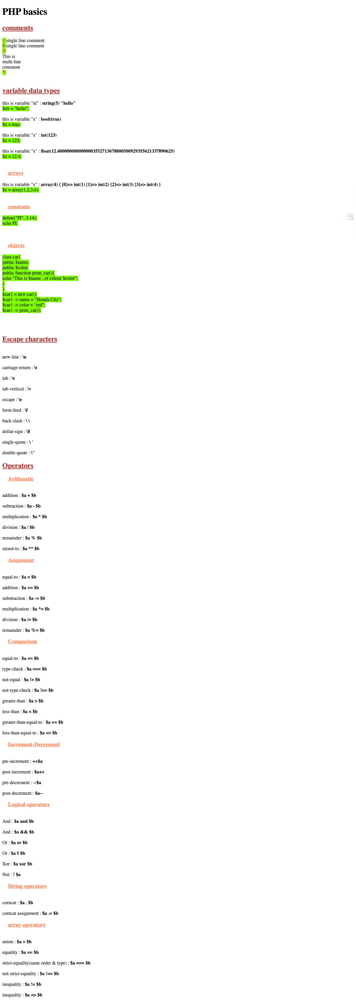

# php101

Here are some descriptions for a GitHub repo named "php basics":

**Short and sweet:**

* Learn the fundamentals of PHP programming.

**Informative:**

* This repository provides a foundation for learning PHP, covering essential concepts like variables, data types, control flow, functions, and more. Perfect for beginners with no prior programming experience.

**Engaging:**

* Dive into the world of PHP development with this beginner-friendly repository!  Explore core functionalities and get hands-on with practical examples.

**Bonus:**

* You can also consider adding keywords relevant to PHP basics, like: syntax, operators, arrays, forms, or database interaction. 
* For example: "Learn the building blocks of PHP: syntax, variables, operators, control flow, functions, arrays, and forms."

